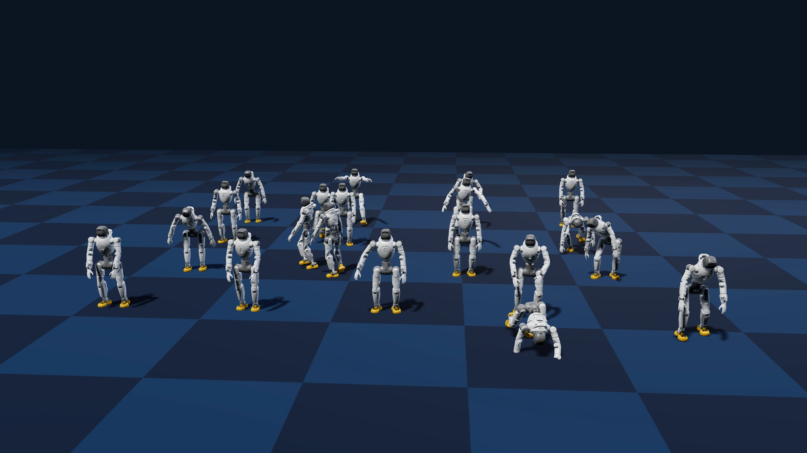
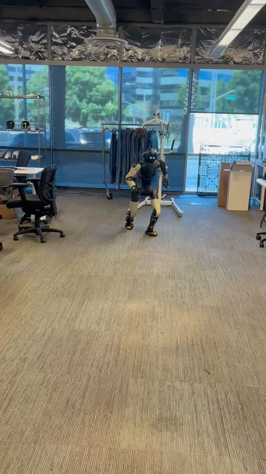
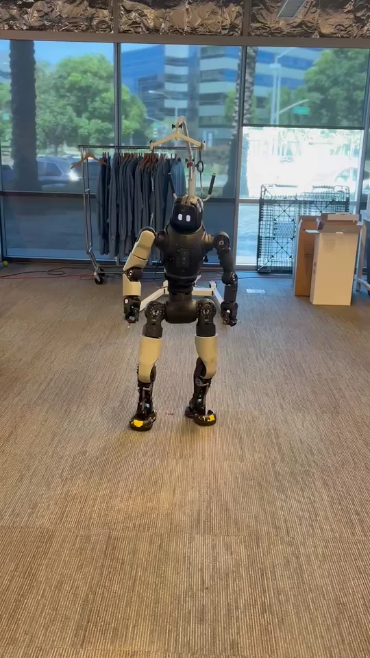
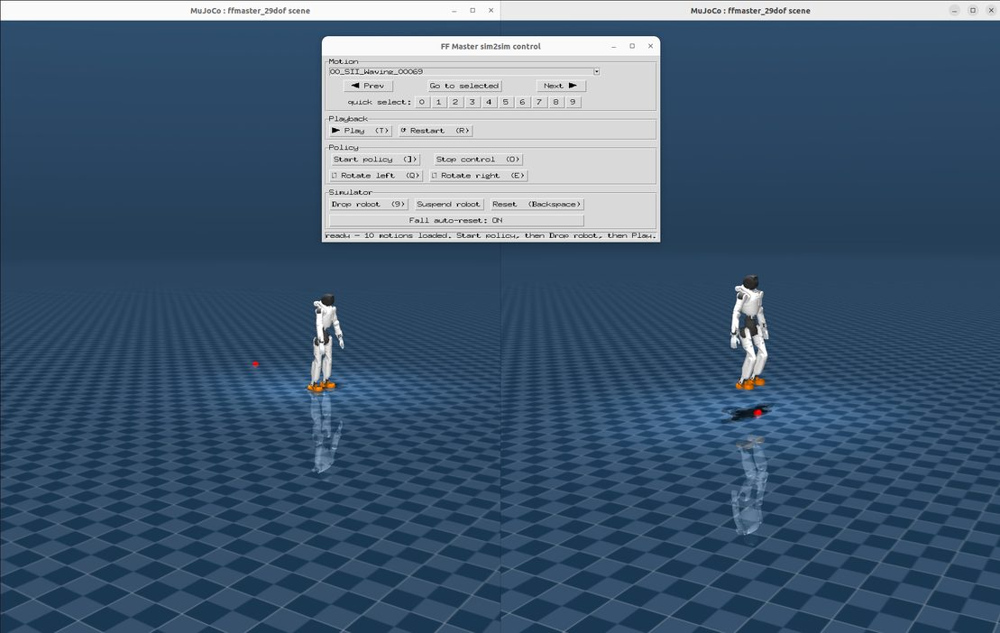

# FFEAI-WBC

In-house whole-body control framework for FF robots, based on NVIDIA [GR00T-WholeBodyControl](https://github.com/NVlabs/GR00T-WholeBodyControl) / [GEAR-SONIC](https://nvlabs.github.io/GEAR-SONIC/), with FF Master robot integration and training/deployment tooling.

## News

- **[2026-09]** First FF Master SONIC checkpoint released (`ffmaster_sonic_v0.1`, early training snapshot). Models and configs are updated progressively as training and evaluation progress. See [Model Card](#model-card).
- **[2026-09]** Unitree G1 → FF Master retarget of the ChingMU MotionDecode dataset released on Hugging Face, with an interactive web viewer. See [Motion Data](#motion-data).

## Table of Contents

- [Motion Showcase](#motion-showcase)
- [SONIC on FF Master](#sonic-on-ff-master)
- [Model Card](#model-card)
- [Setup](#setup)
- [Usage](#usage)
- [Motion Data](#motion-data)
- [SONIC Training](#sonic-training)
- [What's Included](#whats-included)
- [Documentation](#documentation)
- [Acknowledgments](#acknowledgments)
- [License](#license)

## Motion Showcase



- [Unitree G1 → FF Master web viewer](https://zhiyangrobot.github.io/g1-ffmaster-retarget/)
- [Unitree G1 → FF Master retarget dataset](https://huggingface.co/datasets/zhiyangrobot/g1-ffmaster-retarget)

### WBC demos

<p align="center">
<table>
  <tr>
    <td align="center"></td>
    <td align="center"></td>
    <td align="center"></td>
  </tr>
</table>
</p>

## SONIC on FF Master

SONIC is a motion-tracking whole-body controller: one policy reads a reference motion and the robot's recent state and outputs joint-position targets at 50 Hz. This fork adds FF Master (29 controlled joints) as a SONIC embodiment and everything needed to run it:

- FF Master robot assets, training configuration (`sonic_ffmaster`), evaluation and ONNX export
- MuJoCo sim2sim for FF Master (`--wbc-version ffmaster_sonic_model12`, `deploy.sh --robot ffmaster`), a GUI control panel and a verification harness
- The C++ TensorRT deployment binary built for FF Master (`ffmaster_deploy_onnx_ref`)
- A ROS 2 bridge and session scripts for running the policy on the physical robot
- Reference motion sets built from the retargeted MotionDecode data (downloaded separately)

## Model Card

| Model | Training data | Iterations | Encoder modes | Status |
|---|---|---|---|---|
| **ffmaster_sonic_v0.1** | FF Master retarget of ChingMU MotionDecode (36k clips, ~358 h), trained from scratch with `sonic_ffmaster` at 8 × 16,384 environments | 6,000 | 0 = motion tracking, 1 = VR 3-point teleop | early snapshot: stands, tracks gestures and basic gaits in MuJoCo; not yet converged |

The model has no SMPL encoder (the dataset has no SMPL pairing), so encoder mode 2 is not available. Later checkpoints of the same run will replace this entry as training progresses; each release states its iteration count and evaluation. Test every new checkpoint in simulation before running it on a robot.

### Release files

The model, the robot meshes, reference motion sets and lab data are not kept in git. `download_ffmaster_assets.sh` fetches them and puts them in place:

| Bundle | Contents | Installed to |
|---|---|---|
| `ffmaster_sonic_v0.1` | `model_encoder.onnx` (910 → 64), `model_decoder.onnx` (994 → 29), `observation_config.yaml`, fused `model_g1.onnx` / `model_teleop.onnx`, PyTorch `model_step_006000.pt` + `config.yaml` | `gear_sonic_deploy/policy/ffmaster/`, `sonic_ffmaster/` |
| `ffmaster_reference_sets` | `ffmaster_set8` (10 indexed clips), `chingmu_ffmaster_gantry_small` (3), `chingmu_ffmaster_loco_small` (5), `chingmu_ffmaster_gantry` (25), `chingmu_ffmaster_loco` (25) | `gear_sonic_deploy/reference/` |
| `ffmaster_lab_data` | `lab_train` (50 clips) and `lab_eval` (10 clips) in training format | `data/ffmaster_motions/` |
| `ffmaster_robot_meshes` | the 45 STL meshes referenced by the FF Master MJCF and URDF | `gear_sonic/data/assets/robot_description/{mjcf,urdf/ffmaster}/meshes/` |

## Setup

> **Git LFS required.** Robot meshes and vendored libraries are LFS objects. Install Git LFS first: `sudo apt install git-lfs && git lfs install`.

```bash
git clone -b ffmaster_sonic https://github.com/ff-eai/FFEAI-WBC.git
cd FFEAI-WBC
git lfs pull
bash download_ffmaster_assets.sh          # model + robot meshes + reference sets + lab data (~650 MB)
```

The FF Master code lives on the `ffmaster_sonic` branch.

| I want to... | Environment | How to install |
|---|---|---|
| Run MuJoCo sim2sim | `.venv_sim` | `bash install_scripts/install_mujoco_sim.sh` |
| Build the C++ deploy binary | system (TensorRT 10.13 on x86_64, 10.7 on Jetson) | `cd gear_sonic_deploy && ./scripts/install_deps.sh && source scripts/setup_env.sh && HAS_ROS2=0 just build` |
| Convert motion data, train, evaluate, export | Isaac Lab Python env | [Install Isaac Lab](https://isaac-sim.github.io/IsaacLab/main/source/setup/installation/index.html), then `pip install -e "gear_sonic/[training]"` |
| Run on the robot | Orin: JetPack 6, ROS 2 Humble, TensorRT 10.7 | [`docs/labs/instructor_setup.md`](docs/labs/instructor_setup.md) |

Details for each environment are in NVIDIA's [installation guides](https://nvlabs.github.io/GR00T-WholeBodyControl/getting_started/installation_deploy.html). `HAS_ROS2=0` keeps the build on the plain DDS path; on workstations with ROS 2 installed, `setup_env.sh` otherwise enables a ROS 2 input handler that does not compile on Ubuntu 22.04 and is not needed for FF Master (`deploy.sh` sets the same flag).

## Usage

### MuJoCo sim2sim



Two terminals from the repository root:

```bash
# Terminal 1: simulator
source .venv_sim/bin/activate
python gear_sonic/scripts/run_sim_loop.py --wbc-version ffmaster_sonic_model12

# Terminal 2: policy
cd gear_sonic_deploy
bash deploy.sh --robot ffmaster sim          # default motion set: reference/ffmaster_set8/
```

In Terminal 2 press `]` to start the policy, then `9` in the MuJoCo window to release the robot. `t` plays the current reference motion, `n`/`p` or digits `0`–`9` select another, `r` returns to frame 0, `o` stops.

Or use the control panel, which runs both processes and can show the reference motion in a second window next to the policy:

```bash
.venv_sim/bin/python gear_sonic_deploy/sim2sim_verify/ffmaster_control_panel.py \
    --motion-dir reference/ffmaster_set8/ --with-replay
```

Automated checks (falls sweep over a set, joint-tracking RMS on one clip, repeated stress trials):

```bash
.venv_sim/bin/python gear_sonic_deploy/sim2sim_verify/ffmaster_verify.py sweep --motion-dir reference/ffmaster_set8/
.venv_sim/bin/python gear_sonic_deploy/sim2sim_verify/ffmaster_verify.py rms --motion-dir reference/ffmaster_set8/ --motion 06_BG_Normal_Walking_00547
```

### Reference motion sets

| Directory under `gear_sonic_deploy/reference/` | Clips | Contents |
|---|---|---|
| `chingmu_ffmaster_gantry_small/` | 3 | waving, special gestures, bowing; feet planted |
| `chingmu_ffmaster_loco_small/` | 5 | walking, jogging, running, turning in place, arms folded |
| `ffmaster_set8/` | 10 | indexed demo list (slots `00`–`09`): gestures, bends, expressive motions, walk, jog, throws |
| `chingmu_ffmaster_gantry/`, `chingmu_ffmaster_loco/` | 25 + 25 | the full gesture and locomotion sets; clip lists in `chingmu_ffmaster_*_clips.txt` |

### Real robot

The policy binary runs on FF Master's onboard Orin through a ROS 2 bridge (`gear_sonic_deploy/src/ffmaster/sonic_ffmaster_bridge`). Session scripts are in `gear_sonic_deploy/hardware_bringup/`; `make_robot_bundle.sh` there packs the scripts, the deploy tree, the released ONNX pair, the reference sets and the build headers into one archive that unpacks to `~/sonic_deployment` on the Orin (build steps in the instructor setup).

```bash
# on the Orin, three shells
python3 ~/sonic_deployment/ffmaster_migrate.py Develop_MC     # hand the joint bus to the bridge
~/sonic_deployment/ffmaster_bridge.sh                          # bridge: wait for ACTIVE
~/sonic_deployment/ffmaster_sonic.sh ffmaster_set8 006000      # policy: wait for Init Done, then ]
```

Use the gantry and follow the procedure in [`docs/labs/sonic_ffmaster_lab.md`](docs/labs/sonic_ffmaster_lab.md) (Part D) and [`docs/labs/instructor_setup.md`](docs/labs/instructor_setup.md). Recording and offline evaluation of a session: `ffmaster_record.py`, `ffmaster_eval.py`.

## Motion Data

The training and reference data is the ChingMU MotionDecode motion library, retargeted from Unitree G1 to FF Master with the NVIDIA SOMA Retargeter and released at [`zhiyangrobot/g1-ffmaster-retarget`](https://huggingface.co/datasets/zhiyangrobot/g1-ffmaster-retarget). CSVs live under `csv/ff_master/<category>/<subcategory>/<clip>.csv`, one row per frame at 120 fps, root translation in cm, angles in degrees, 31 joint columns in FF Master joint order (wrist and head columns are zero).

```bash
pip install -U "huggingface_hub[cli]"
huggingface-cli download zhiyangrobot/g1-ffmaster-retarget --repo-type dataset \
    --include "csv/ff_master/1.8.Social_and_Interpersonal_Interaction/*" --local-dir data/chingmu_csv
```

Convert clips into reference motions for the deploy binary (Isaac Lab env):

```bash
# flatten the nested categories and drop duplicate stems
python tools/chingmu/stage_chingmu.py --root data/chingmu_csv/csv/ff_master --stage data/chingmu/stage
# CSV (120 fps) -> motion library PKLs (30 fps); then drop the corrupt last frame MotionDecode clips carry
python gear_sonic/data_process/convert_soma_csv_to_motion_lib.py --robot ffmaster \
    --input data/chingmu/stage --output data/chingmu/pkl --individual --fps 30 --fps_source 120 --num_workers 16
python tools/chingmu/trim_pkl_last_frame.py --pkl-dir data/chingmu/pkl
# PKLs -> deploy PKL (50 fps, tracked-body kinematics) -> one folder per clip
python gear_sonic/data_process/export_deploy_reference.py --robot ffmaster \
    --motion_dir data/chingmu/pkl/<session> --output data/chingmu/deploy_ref.pkl
python gear_sonic_deploy/reference/convert_motions.py data/chingmu/deploy_ref.pkl gear_sonic_deploy/reference/my_set
```

Always convert 120 → 30 fps; `--fps 50` silently produces 60 fps playback.

## SONIC Training

The FF Master configuration is `manager/universal_token/all_modes/sonic_ffmaster`: two encoders (motion tracking, teleop), no SMPL. It trains from scratch on the converted MotionDecode data or fine-tunes from the released checkpoint.

```bash
# Isaac Lab env. Data: stage + convert + trim as in Motion Data, over the whole csv/ff_master tree.
# Optional quality filter: validate clips, then build the training set and a seeded 512-clip eval subset
python tools/chingmu/validate_ffmaster_csv.py --root data/chingmu_csv/csv/ff_master --out data/chingmu/validation --workers 16
python tools/chingmu/build_sets.py --per-clip data/chingmu/validation/per_clip.tsv \
    --stage data/chingmu/stage --pkl data/chingmu/pkl --out data/chingmu/sets

# Train from scratch (8 GPUs)
accelerate launch --num_processes=8 gear_sonic/train_agent_trl.py \
    +exp=manager/universal_token/all_modes/sonic_ffmaster \
    num_envs=16384 headless=True exp_var=v1 \
    ++manager_env.config.gpu_max_rigid_patch_count=655360 \
    ++manager_env.commands.motion.motion_lib_cfg.motion_file=data/chingmu/sets/chingmu_train_v1

# Fine-tune from the released checkpoint (single GPU shown)
python gear_sonic/train_agent_trl.py \
    +exp=manager/universal_token/all_modes/sonic_ffmaster \
    +checkpoint=sonic_ffmaster/model_step_006000.pt \
    num_envs=4096 headless=True exp_var=finetune \
    ++manager_env.commands.motion.motion_lib_cfg.motion_file=data/chingmu/sets/chingmu_train_v1

# Evaluate a checkpoint (success rate, MPJPE) on a motion directory
python gear_sonic/eval_agent_trl.py +checkpoint=<run>/model_step_NNNNNN.pt +headless=True \
    ++eval_callbacks=im_eval ++run_eval_loop=False ++num_envs=128 ++eval_output_dir=<out_dir> \
    "+manager_env/terminations=tracking/eval" \
    "++manager_env.terminations.ee_body_pos.params.body_names=[left_ankle_roll_link,right_ankle_roll_link,left_wrist_roll_link,right_wrist_roll_link]" \
    ++manager_env.commands.motion.motion_lib_cfg.motion_file=data/chingmu/sets/chingmu_train_v1_eval512 \
    ++manager_env.commands.motion.motion_lib_cfg.multi_thread=false

# Export ONNX for deployment (writes <run>/exported/model_step_NNNNNN_{encoder,decoder}.onnx)
python gear_sonic/eval_agent_trl.py +checkpoint=<run>/model_step_NNNNNN.pt +headless=True ++num_envs=1 +export_onnx_only=true
```

Evaluation and export rebuild the environment from the `config.yaml` next to the checkpoint. For the **released** checkpoint that config points at the full training set, so pass an existing motion directory, for example `++manager_env.commands.motion.motion_lib_cfg.motion_file=data/ffmaster_motions/lab_eval` (installed by the download script); checkpoints from your own runs already point at your data.

Deploy an exported pair with `deploy.sh --robot ffmaster --cp <run>/exported/model_step_NNNNNN sim`; the observation layout in `gear_sonic_deploy/policy/ffmaster/observation_config.yaml` applies to every `sonic_ffmaster` checkpoint. Contact-patch buffer: keep `gpu_max_rigid_patch_count=655360` for runs with more than about 8k environments per GPU, otherwise PhysX drops foot contacts silently.

Multi-node training, W&B logging and the adaptive-sampling options are unchanged from NVIDIA's [Training Guide](https://nvlabs.github.io/GR00T-WholeBodyControl/user_guide/training.html).

## What's Included

- **`gear_sonic_deploy`**: C++ inference stack with the FF Master binary target, ROS 2 bridge (`src/ffmaster/sonic_ffmaster_bridge`), robot session scripts (`hardware_bringup/`), sim2sim tools (`sim2sim_verify/`)
- **`gear_sonic`**: SONIC training stack with the FF Master embodiment (`envs/manager_env/robots/ffmaster.py`), configuration (`config/exp/.../sonic_ffmaster.yaml`), data converters with `--robot ffmaster`, MuJoCo simulator configuration
- **`gear_sonic/data/assets/robot_description`**: FF Master MJCF (`mjcf/ffmaster_sonic_29dof.xml`, `mjcf/ffmaster_scene_29dof.xml`) and URDF (`urdf/ffmaster/`); the meshes come from the release bundle
- **`tools/chingmu`**: staging, validation, trimming and set-building tools for the retargeted MotionDecode data
- **`docs/labs`**: a hands-on lab that uses this stack to teach learned whole-body control
- **`download_ffmaster_assets.sh`**: fetches the model, robot meshes, reference sets and lab data

## Documentation

- NVIDIA GR00T-WholeBodyControl: [full documentation](https://nvlabs.github.io/GR00T-WholeBodyControl/), [Quick Start](https://nvlabs.github.io/GR00T-WholeBodyControl/getting_started/quickstart.html), [Training Guide](https://nvlabs.github.io/GR00T-WholeBodyControl/user_guide/training.html)
- FF Master lab: [`docs/labs/sonic_ffmaster_lab.md`](docs/labs/sonic_ffmaster_lab.md)
- Instructor and deployment setup: [`docs/labs/instructor_setup.md`](docs/labs/instructor_setup.md)

## Acknowledgments

We would like to acknowledge the following projects and datasets that this work builds on:

- [NVlabs/GR00T-WholeBodyControl](https://github.com/NVlabs/GR00T-WholeBodyControl) — source codebase for whole-body control / GEAR-SONIC components used in this repo
- [NVIDIA/soma-retargeter](https://github.com/NVIDIA/soma-retargeter) — motion retargeting tooling used for Unitree G1 → FF Master conversion
- [ChingMU MotionDecode](https://chingmudata.github.io/MotionDecode/) — motion dataset / showcase that our retarget demos and training data build on


## License

This repository's original content is released for **non-commercial research, education, and community use only**.

Third-party components retain their own licenses: NVIDIA GR00T-WholeBodyControl and SOMA Retargeter (Apache-2.0), ChingMU MotionDecode (see the dataset card). This project may download and install additional third-party open-source components. Review their license terms before use.
