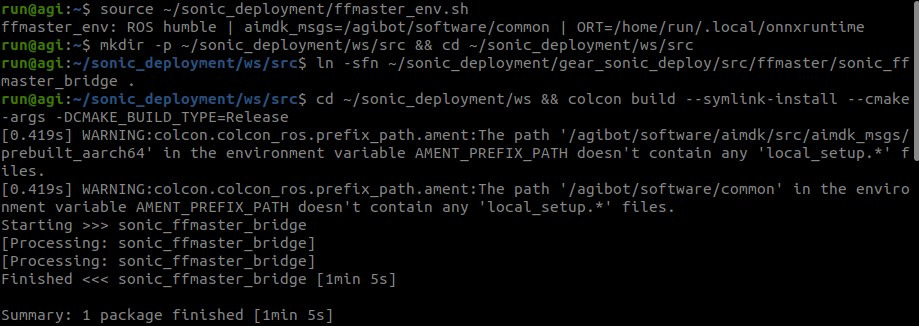
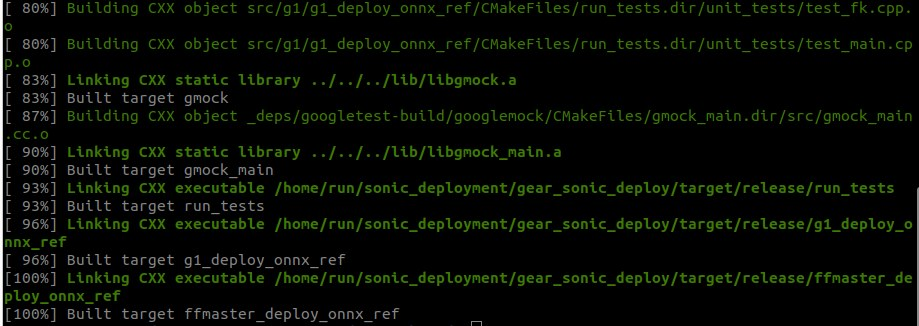

# Instructor Setup

Prepare each workstation before the first session (about half a day for the first one, an hour per additional one) and the robot side before Part D.

## Workstation

Ubuntu 22.04, an NVIDIA GPU with 24 GB or more (the timings below are from an RTX A6000), CUDA 12.x driver, Git LFS, conda or miniforge, about 30 GB free. Every command runs from the repository root unless a `cd` says otherwise. Each step lists what a successful run prints; if yours differs, stop there.

### 1. Clone

```bash
sudo apt install git-lfs && git lfs install      # once per machine
git clone -b ffmaster_sonic https://github.com/ff-eai/FFEAI-WBC.git
cd FFEAI-WBC && git lfs pull                      # ~155 MB of meshes and vendored libraries
```

Check: `git lfs ls-files | wc -l` prints `73`, and `file gear_sonic_deploy/thirdparty/unitree_sdk2/lib/x86_64/libunitree_sdk2.a` says `current ar archive`, not `ASCII text`.

### 2. Released model, meshes, reference sets, lab data

```bash
bash download_ffmaster_assets.sh                  # ~650 MB from the GitHub release
```

Expected output:

```
downloading https://github.com/ff-eai/FFEAI-WBC/releases/download/assets-v0.1/ffmaster_sonic_v0.1.tar.gz
model  -> gear_sonic_deploy/policy/ffmaster/ and sonic_ffmaster/
downloading .../ffmaster_robot_meshes.tar.gz
meshes -> gear_sonic/data/assets/robot_description/{mjcf,urdf/ffmaster}/meshes/ (45 files)
downloading .../ffmaster_reference_sets.tar.gz
reference sets -> gear_sonic_deploy/reference/: chingmu_ffmaster_gantry chingmu_ffmaster_gantry_small chingmu_ffmaster_loco chingmu_ffmaster_loco_small ffmaster_set8
downloading .../ffmaster_lab_data.tar.gz
lab data -> data/ffmaster_motions/: lab_eval lab_train
done
```

Check: `ls gear_sonic_deploy/policy/ffmaster sonic_ffmaster gear_sonic_deploy/reference data/ffmaster_motions`.

### 3. MuJoCo environment (`.venv_sim`, Parts A and C)

```bash
bash install_scripts/install_mujoco_sim.sh        # a few minutes; installs uv if missing
```

Expected ending:

```
══════════════════════════════════════════════════
  Setup complete!  Activate the venv with:
    source .venv_sim/bin/activate
  You should see (gear_sonic_sim) in your prompt.
  Then run the MuJoCo simulator with:
    python gear_sonic/scripts/run_sim_loop.py
══════════════════════════════════════════════════
```

The prompt name `(gear_sonic_sim)` is expected although the folder is `.venv_sim`. Ignore the `run_sim_loop.py` hint; it is the upstream G1 simulator and is not used here.

Check: `.venv_sim/bin/python -c "import mujoco; print(mujoco.__version__)"`.

### 4. Deploy binary (Parts A and C)

TensorRT 10.13 for x86_64 must be installed first. Follow NVIDIA's [Installation (Deployment) › Prerequisites](https://nvlabs.github.io/GR00T-WholeBodyControl/getting_started/installation_deploy.html#prerequisites) for the TensorRT download and `TensorRT_ROOT`, then:

```bash
cd gear_sonic_deploy
./scripts/install_deps.sh                         # sudo: cmake, just, msgpack, ...
source scripts/setup_env.sh
HAS_ROS2=0 just build                             # ~10 min on the first build
cd ..
```

Expected ending:

```
[100%] Built target ffmaster_deploy_onnx_ref
[100%] Built target g1_deploy_onnx_ref
```

`HAS_ROS2=0` keeps the build on the plain DDS input path; with ROS 2 sourced on the workstation the ROS 2 input handler fails to compile.

Check: `ls -la gear_sonic_deploy/target/release/ffmaster_deploy_onnx_ref`.

### 5. First sim2sim run (control panel)

```bash
.venv_sim/bin/python gear_sonic_deploy/sim2sim_verify/ffmaster_control_panel.py \
    --motion-dir reference/ffmaster_set8/ --with-replay
```

Three windows open: the control panel, the MuJoCo simulator with FF Master hanging from an elastic band, and the reference replay. The first start compiles the TensorRT engines (about half a minute on an RTX A6000, a few minutes on smaller GPUs) and leaves two `.trt` files next to the ONNX pair in `gear_sonic_deploy/policy/ffmaster/`; later starts take seconds. The panel status line reads `starting deploy (TensorRT build on first run)...` until the binary prints:

```
Reading motion data from CSV files in: reference/ffmaster_set8/
Found 10 motion folders
✓ Loaded 00_SII_Waving_00069 (1065 timesteps)
...
✓ Motion data loaded successfully!
Started with motion: 00_SII_Waving_00069 (paused at frame 0)
Loading policy model...
✓ Successfully converted ONNX to TRT: policy/ffmaster/policy_model_decoder.trt
✓ Policy engine initialized successfully!
  Model: policy/ffmaster/model_decoder.onnx
  Input dimension: 994
  Action dimension: 29
...
  Encoder dimension: 64
...
Initialized keyboard input interface
```

and the status line changes to `ready — 10 motions loaded. Start policy, then Drop robot, then Play.` Then **Start policy**, wait about ten seconds, **Drop robot**: the robot stands at about 0.67 m pelvis height. Select slot `00` and **Play**: both simulator windows play the waving clip.


### 6. Verify tool

```bash
V=".venv_sim/bin/python gear_sonic_deploy/sim2sim_verify/ffmaster_verify.py"
$V sweep --motion-dir reference/ffmaster_set8/
$V rms   --motion-dir reference/ffmaster_set8/ --motion 00_SII_Waving_00069
```

Expected output (numbers vary by a few hundredths between runs; all ten clips should pass and the waving RMS should be in the 6 to 8 degree range):

```
[sweep] 10 motions in reference/ffmaster_set8/
[sweep] standing at z=0.670
[sweep] 00_SII_Waving_00069: z_min=0.666 z_end=0.669 (ref 0.67->0.67) PASS
[sweep] 01_SII_Bowing_00685: z_min=0.662 z_end=0.668 (ref 0.66->0.67) PASS
[sweep] 02_DB_Bending_Squatting_Stretching_00162: z_min=0.457 z_end=0.669 (ref 0.37->0.66) PASS
...
[sweep] 09_BM_Baseball_Throw_00049: z_min=0.608 z_end=0.665 (ref 0.64->0.66) PASS
[sweep] DONE: 10/10 pass
```

```
[rms] 00_SII_Waving_00069: all-DoF 6.51 deg, legs 5.00, arms 7.81
```

Each run overwrites `gear_sonic_deploy/sim2sim_verify/last_sweep.json` and `last_rms_traj.npz`.

### 7. Isaac Lab environment (`sonic`, Parts B and C)

Follow NVIDIA's [Installation (Training)](https://nvlabs.github.io/GR00T-WholeBodyControl/getting_started/installation_training.html) from [Prerequisites](https://nvlabs.github.io/GR00T-WholeBodyControl/getting_started/installation_training.html#prerequisites) through [Install gear_sonic (Training)](https://nvlabs.github.io/GR00T-WholeBodyControl/getting_started/installation_training.html#install-gear-sonic-training), with two changes: name the conda environment `sonic` (the handout says `conda activate sonic`), and run `pip install -e "gear_sonic/[training]"` from this repository, not NVIDIA's. Skip their *Download Model and Data from Hugging Face* and *Prepare Robot Motion Data* sections; they cover the Bones-SEED data, which this lab does not use. Their *Verify Installation* smoke test needs that data too; use step 8 below instead.

Weights & Biases is optional: the handout's `use_wandb=true wandb.wandb_project=sonic-labs` needs `wandb login` on each workstation; otherwise students run with `use_wandb=false`.

Check: `conda activate sonic && python -c "import isaaclab, gear_sonic; print(isaaclab.__version__)"`.

### 8. Training smoke test (Part B command, 20 iterations)

```bash
conda activate sonic
python gear_sonic/train_agent_trl.py \
    +exp=manager/universal_token/all_modes/sonic_ffmaster \
    +checkpoint=sonic_ffmaster/model_step_006000.pt \
    num_envs=2048 headless=True exp_var=smoke use_wandb=false \
    callbacks.model_save.save_frequency=10 \
    ++algo.config.num_learning_iterations=20 \
    ++manager_env.commands.motion.motion_lib_cfg.motion_file=data/ffmaster_motions/lab_train
```

Isaac Sim takes a few minutes to start (longer the first time, while it compiles shaders); the whole smoke test took a little over two minutes on an RTX A6000. Expected, once running:

```
Loading checkpoint from sonic_ffmaster/model_step_006000.pt
...
│                          Learning iteration 2                          │
│                        Computation: 12601 steps/s (Collection: 2.932s,       │
│ Learning 0.968s)                                                             │
│              Mean action noise std: 0.49                                     │
│                       Mean rewards: 0.39953                                  │
│                        Mean length: 26.01000                                 │
│ Env/Episode_Reward/tracking_anchor_pos: 0.0232                               │
...
│ Env/Episode_Reward/tracking_vr_5point_local: ...                             │
...
│ Logging Directory:                                                           │
│ logs_rl/TRL_FFMaster/manager/universal_token/all_modes/sonic_ffmaster_smoke- │
│ 20260917_171218                                                              │
```

Check: `ls logs_rl/TRL_FFMaster/manager/universal_token/all_modes/sonic_ffmaster_smoke-*/` shows `model_step_000010.pt` and `model_step_000020.pt`.

### 9. Evaluation and export smoke test (Part C commands on the released checkpoint)

About two minutes for the evaluation, half a minute for the export, four minutes for the sweep.

```bash
python gear_sonic/eval_agent_trl.py +checkpoint=sonic_ffmaster/model_step_006000.pt +headless=True \
    ++eval_callbacks=im_eval ++run_eval_loop=False ++num_envs=10 \
    ++eval_output_dir=results/eval_006000 \
    "+manager_env/terminations=tracking/eval" \
    "++manager_env.terminations.ee_body_pos.params.body_names=[left_ankle_roll_link,right_ankle_roll_link,left_wrist_roll_link,right_wrist_roll_link]" \
    ++manager_env.commands.motion.motion_lib_cfg.motion_file=data/ffmaster_motions/lab_eval \
    ++manager_env.commands.motion.motion_lib_cfg.multi_thread=false
```

Expected:

```
Terminated: 1 | max frames: 1234 | steps 1233 | env_loop: 0 | eval_time: 1.4m | ... | Succ rate: 0.000 | Mpjpe: nan: 100%|██████████|
```

The progress bar's `Succ rate` and `Mpjpe` stay at 0 and `nan` while it runs; the numbers are in `results/eval_006000/metrics_eval.json`. The handout's summary snippet prints them:

```
006000: success 0.90  mpjpe_l 35.1 mm  mpjpe_g 353.2 mm
  EESB_Intense_Joy_00013                        ok      34.1 mm
  SII_Waving_00069                              ok      23.8 mm
  ...
  BM_Baseball_Throw_00049                       FAIL    41.9 mm
  SII_Bowing_00685                              ok      23.2 mm
```

```bash
python gear_sonic/eval_agent_trl.py +checkpoint=sonic_ffmaster/model_step_006000.pt +headless=True \
    ++num_envs=1 +export_onnx_only=true \
    ++manager_env.commands.motion.motion_lib_cfg.motion_file=data/ffmaster_motions/lab_eval
E=$PWD/sonic_ffmaster/exported/model_step_006000_encoder.onnx
D=$PWD/sonic_ffmaster/exported/model_step_006000_decoder.onnx
$V sweep --motion-dir reference/ffmaster_set8/ --encoder $E --decoder $D
```

Expected:

```
Exported ONNX model: g1 encoder -> g1_dyn decoder
Saved to: sonic_ffmaster/exported/model_step_006000_g1.onnx
Exported ONNX model: teleop encoder -> g1_dyn decoder
Saved to: sonic_ffmaster/exported/model_step_006000_teleop.onnx
Exported ENCODERS ONLY ONNX model with 2 encoders: ['g1', 'teleop']
Saved to: sonic_ffmaster/exported/model_step_006000_encoder.onnx
Exported DECODER ONLY ONNX model with decoder: g1_dyn
Saved to: sonic_ffmaster/exported/model_step_006000_decoder.onnx
```

followed by a sweep ending in `[sweep] DONE: 10/10 pass`.

### 10. Before class

Timing on the class GPU: one Part B iteration at 2,048 environments (multiply by 1,000; expect one to two hours on a 48 GB card) and one Part C evaluation on `lab_eval` (a few minutes plus Isaac Sim start-up). Consider pre-running one Part B run so a team whose run fails still has checkpoints.

- [ ] Step 5: policy starts, robot stands after Drop, slot `00` plays
- [ ] Step 6: sweep ends `DONE: 10/10 pass`
- [ ] Step 8: two checkpoints written
- [ ] Step 9: `metrics_eval.json` and the ONNX pair produced; the sweep accepts them

## Robot side

Baseline: the FF flash image already provides everything below except ONNX Runtime, and automatic package updates are disabled on the robot, so versions do not drift. Tested on firmware `release-lx2501_3_t2d5-soc1-v1.0.11`: Orin with JetPack 6.2 (L4T R36.4.3, Ubuntu 22.04), CUDA 12.6, TensorRT 10.7; ROS 2 Humble `ros-base` with the FastRTPS middleware; cmake, colcon, gcc and the googletest source; the vendor's ROS 2 SDK at `/agibot/software/common` (`aimdk_msgs` 0.8.24). Nothing is installed system-wide for SONIC; everything of ours lives in `$HOME` of user `run` (ONNX Runtime under `~/.local`, the deployment folder). The Orin's address on the robot's internal network is fixed at `10.0.1.41` (interface `develop0`) and the bridge's FastDDS profile relies on it; `<orin>` below is its address on the lab network. Gantry, clear floor, a laptop with SSH to the Orin. Commands run on the Orin unless marked otherwise.

### 1. ONNX Runtime 1.16.3 (once per Orin; the deploy binary links against it)

```bash
curl -L https://github.com/microsoft/onnxruntime/releases/download/v1.16.3/onnxruntime-linux-aarch64-1.16.3.tgz | tar xz -C /tmp
mkdir -p ~/.local && mv /tmp/onnxruntime-linux-aarch64-1.16.3 ~/.local/onnxruntime
```

Check: `cat ~/.local/onnxruntime/VERSION_NUMBER` prints `1.16.3`.

### 2. Deployment folder

`~/sonic_deployment` is not in the repository or the release. `make_robot_bundle.sh` builds it on the workstation from the `gear_sonic_deploy/` tree, the released ONNX pair, the reference sets and the msgpack headers, and packs it as one archive. If an older `~/sonic_deployment` exists on the Orin (for example one with `x2_*` scripts), move it aside first: `mv ~/sonic_deployment ~/sonic_deployment_old`.

```bash
# workstation, after download_ffmaster_assets.sh and git lfs pull
cd ~/FFEAI-WBC && bash gear_sonic_deploy/hardware_bringup/make_robot_bundle.sh     # -> robot_bundle/sonic_deployment_006000.tar.gz (~120 MB)
scp robot_bundle/sonic_deployment_006000.tar.gz run@<orin>:~
ssh run@<orin> 'tar xzf sonic_deployment_006000.tar.gz'                            # unpacks to ~/sonic_deployment
```

Expected output of the bundle command:

```
############################################################################################## 100.0%
staged: /home/lab/FFEAI-WBC/robot_bundle/sonic_deployment  (293M)
  checkpoints : model_step_006000_{encoder,decoder}.onnx
  reference   : chingmu_ffmaster_gantry,chingmu_ffmaster_gantry_small,chingmu_ffmaster_loco,chingmu_ffmaster_loco_small,ffmaster_set8
archive: /home/lab/FFEAI-WBC/robot_bundle/sonic_deployment_006000.tar.gz  (121M)

Next, from the workstation (an existing ws/ and build/ on the Orin are kept):
  scp /home/lab/FFEAI-WBC/robot_bundle/sonic_deployment_006000.tar.gz run@<orin>:~
  ssh run@<orin> 'tar xzf sonic_deployment_006000.tar.gz'        # unpacks to ~/sonic_deployment
then continue with "Robot side", step 3 "Build the bridge and the binary", in docs/labs/instructor_setup.md.
```

Check: `ls ~/sonic_deployment` shows `checkpoints`, the `ffmaster_*.sh` and `ffmaster_*.py` scripts, `gear_sonic`, `gear_sonic_deploy`, `recordings`, `thirdparty_headers`.

The archive holds the session scripts at its root, the `gear_sonic_deploy/` tree without build outputs and G1 files, `checkpoints/model_step_006000_{encoder,decoder}.onnx`, every reference set found under `gear_sonic_deploy/reference/`, the msgpack headers in `thirdparty_headers/` (the robot has no `libmsgpack-dev`; `ffmaster_env.sh` puts that folder on the include path) and the FF Master MJCF for `ffmaster_eval.py`. Unpacking over an existing `~/sonic_deployment` keeps `ws/` and `build/`; rebuild after a code change.

The bundle defaults to the released model: it takes `model_encoder.onnx` and `model_decoder.onnx` from `gear_sonic_deploy/policy/ffmaster/` and names them step `006000`, so `ffmaster_sonic.sh <list> 006000` finds them on the Orin. To bundle another checkpoint, point at its export folder and give its step:

```bash
bash gear_sonic_deploy/hardware_bringup/make_robot_bundle.sh \
    --step 001000 --onnx-dir logs_rl/TRL_FFMaster/manager/universal_token/all_modes/sonic_ffmaster_lab_teamA-<timestamp>/exported
```

This produces `sonic_deployment_001000.tar.gz`, started on the robot with `ffmaster_sonic.sh <list> 001000`. When a new model is released into `policy/ffmaster/`, the default step in the script and in this document must be updated with it. `-h` lists the remaining options (`--sets`, `--msgpack`, `--out`).

### 3. Build the bridge and the binary

```bash
source ~/sonic_deployment/ffmaster_env.sh
mkdir -p ~/sonic_deployment/ws/src && cd ~/sonic_deployment/ws/src
ln -sfn ~/sonic_deployment/gear_sonic_deploy/src/ffmaster/sonic_ffmaster_bridge .
cd ~/sonic_deployment/ws && colcon build --symlink-install --cmake-args -DCMAKE_BUILD_TYPE=Release
mkdir -p ~/sonic_deployment/gear_sonic_deploy/build && cd ~/sonic_deployment/gear_sonic_deploy/build
cmake -S .. -B . -DCMAKE_BUILD_TYPE=Release && cmake --build . -j6
```

Expected: the environment script prints `ffmaster_env: ROS humble | aimdk_msgs=/agibot/software/common | ORT=/home/run/.local/onnxruntime`; colcon prints two `WARNING:colcon.colcon_ros.prefix_path.ament` lines about missing `local_setup.*` files for the vendor SDK paths (expected) and ends with `Summary: 1 package finished [1min 5s]`; the cmake build takes a few minutes and ends with `[100%] Built target ffmaster_deploy_onnx_ref`.





If the googletest download fails on the lab network, add `-DFETCHCONTENT_SOURCE_DIR_GOOGLETEST=/usr/src/googletest` to the cmake configure line (JetPack ships that source). A firmware flash wipes `$HOME`; redo steps 1 to 3 after one.

### 4. After every robot boot

```bash
~/sonic_deployment/ffmaster_dds_guard.sh      # prints: dds-guard: applied   (or: already active)
```

It blocks ROS 2 discovery packets arriving from the lab Wi-Fi (UDP 7400 to 7599 on `wifi0`); ROS traffic from workstations on the same Wi-Fi can crash the bridge. The rule lives only until the next reboot. Robot-internal DDS and SSH are unaffected.

### 5. Before the first class

Run Part D of the handout yourself once, on the gantry, with `chingmu_ffmaster_gantry_small`. The first `ffmaster_sonic.sh` start prints `NOTE: no cached TRT engine for model_step_006000 — first start will BAKE`, compiles the TensorRT engines into `checkpoints/` and then reaches `Found 3 motion folders` and `Init Done`; later starts skip the bake. Decide whether the class runs locomotion off the gantry, and if so run `chingmu_ffmaster_loco_small` yourself first with a spotter.

The students run the session themselves in the order of the handout; the instructor supervises and decides whether locomotion runs off the gantry. The abort is `Ctrl-C` in T-B; the robot has no e-stop, so the bridge's damping and the gantry are the only protection.

## Notes for developers

- `ffmaster_control_panel.py`, `ffmaster_replay_viewer.py` and `ffmaster_verify.py` derive the repository root from their own location and pass `policy/ffmaster/observation_config.yaml` to the binary; a model with a different encoder set needs that file swapped.
- `ffmaster_verify.py` overwrites `last_sweep.json` / `last_rms_traj.npz` on every run; copy results out.
- The motion library keys clips by file name; duplicate stems overwrite each other (`tools/chingmu/stage_chingmu.py` handles this for the full dataset). MotionDecode CSVs carry a corrupt final row; `tools/chingmu/trim_pkl_last_frame.py` removes the last converted frame of every clip.
- `+checkpoint=` loads weights only (fresh optimizer, iteration counter from zero); `++resume=True` restores the full trainer state.
- Above roughly 8k environments per GPU pass `++manager_env.config.gpu_max_rigid_patch_count=655360`, or PhysX drops foot contacts silently.
- `ffmaster_env_gate.sh` prints PASS/WARN for the robot's FF package set, firewall order, daemons and topic rates; run it when a session misbehaves to see what changed since the last good one. `ffmaster_observe.py` (`inventory`, `fingerprint`, `imu`; read-only) re-verifies HAL joint order, signs and the IMU frame after a firmware change. `sonic_ffmaster_dummy` is a single-joint node for exercising the transport and damping path without the policy. None of the three is part of a class.
- On the robot, start the policy only through `ffmaster_sonic.sh`; it checks with `ldd` that the binary resolves the SDK's CycloneDDS.
- Wrist columns of the retargeted dataset are zero; the policy holds the wrists at the default pose, so wrist error in hardware reports is expected.
